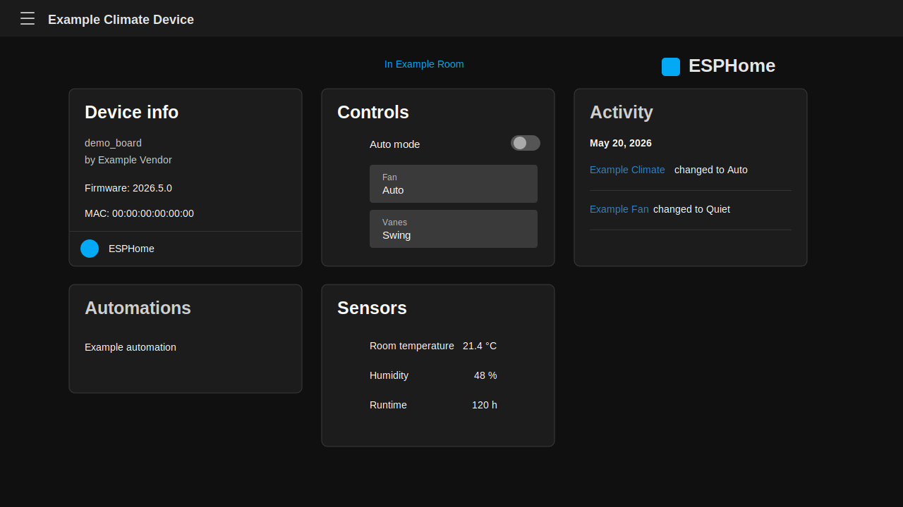

# Device Overview Responsive

Small Home Assistant integration for HACS. It loads a frontend module globally so the card columns on device overview pages use the available screen width instead of staying narrow on wide displays.



## Features

- Detects Home Assistant device overview pages.
- Changes the card container to an auto-fitting CSS grid.
- Uses one column on narrow screens.
- Re-applies after Home Assistant route changes and browser resizing.

## Installation

1. Add this repository to HACS as a custom repository.
2. Select category `Integration`.
3. Install `Device Overview Responsive`.
4. Restart Home Assistant.
5. Add `Device Overview Responsive` under Settings > Devices & services.
6. Hard refresh Home Assistant.

The integration serves and registers this frontend module automatically:

```text
/device_overview_responsive/device-overview-responsive.js
```

## Notes

This integration only registers a frontend module. It does not create entities, helpers, or automations.
